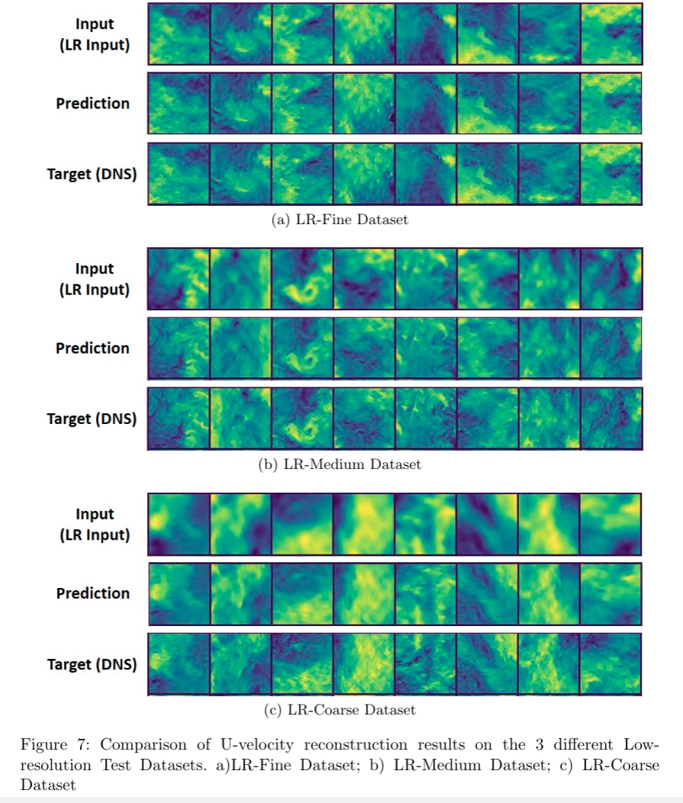
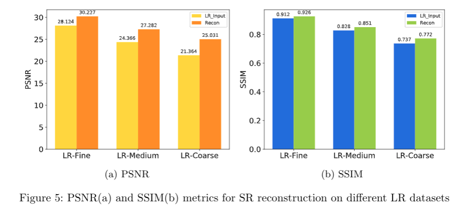

# SR-DNS_Net

## Super-Resolution upsampling of turbulent CFD data

This is the code associated with the paper on [Deep Learning for Efficient Reconstruction of High-Resolution Turbulent DNS Data](https://arxiv.org/abs/2010.11348v2)

Cite as: https://arxiv.org/abs/2010.11348v2

## Architecture

## Results

